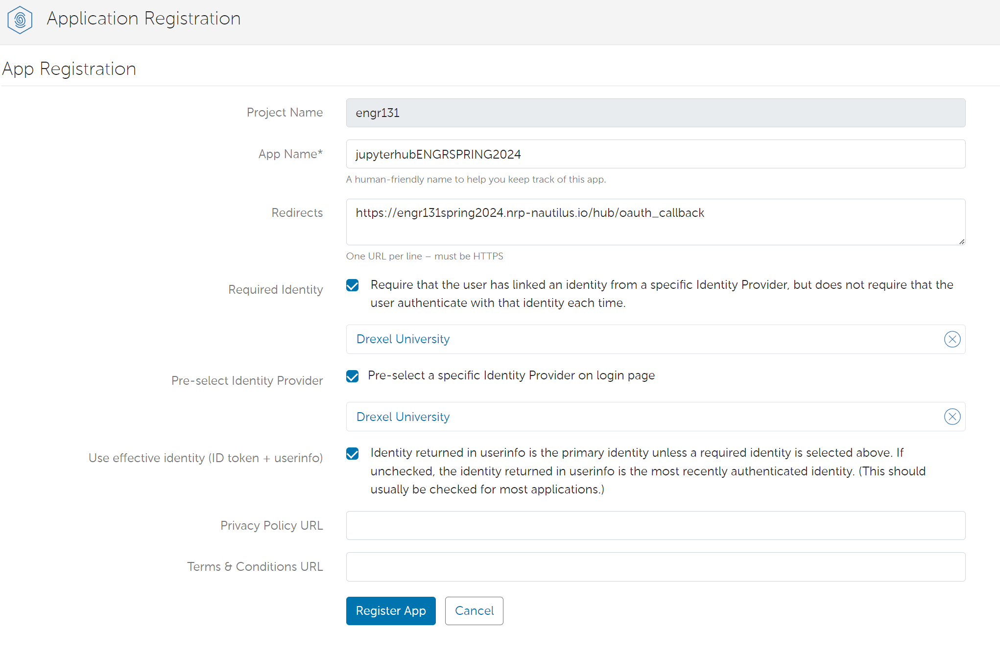
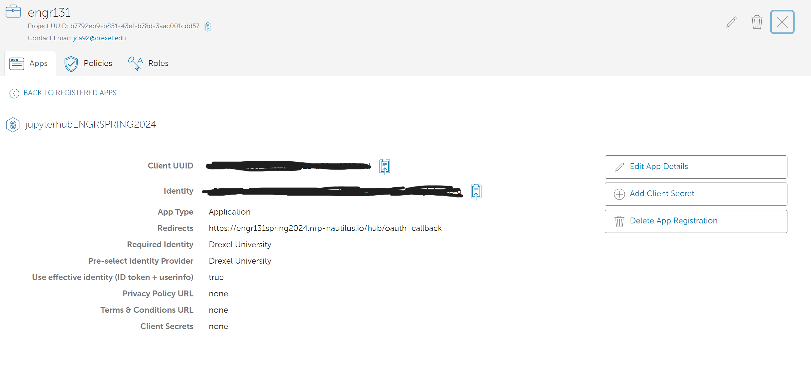
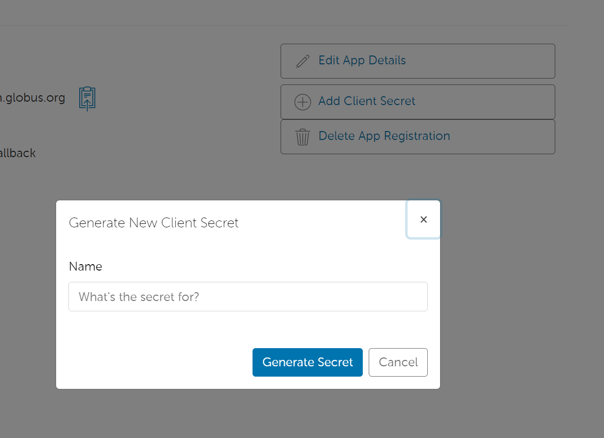
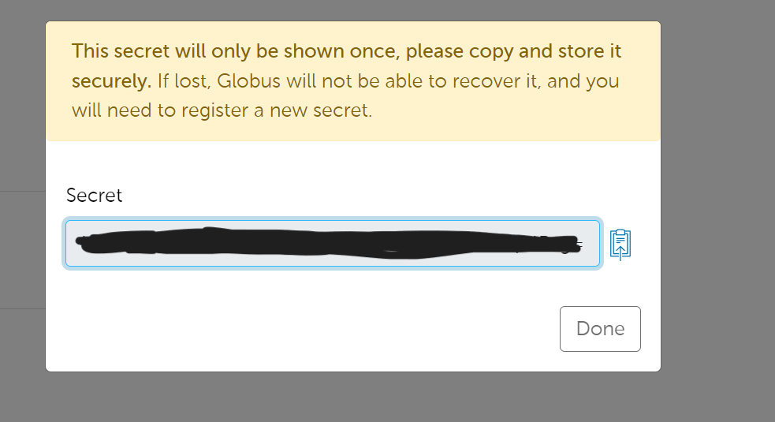

# Deploying a JupyterHub

## Introduction

JupyterHub is a multi-user Jupyter notebook server. It is a great tool for teaching and learning, as it allows students to access a Jupyter notebook environment without having to install anything on their local machine. This guide will walk you through the process of deploying a JupyterHub server on the Nautilus Research Platform.

## Authentication Provided

### Globus Auth

Globus auth allows you to use trusted authentication and authorization to access the JupyterHub server. This is the recommended method for authentication.

#### Registering your application

1. Go to the [Globus Developer Console](https://developers.globus.org/) and log in with your Globus credentials.
1. Click on settings
   
1. Click on the developers tag
   
1. Click on advanced registration
    
1. Register your application
    
    :exclamation: Make sure to add the redirect URL as `https://<your_jupyterhub_url>/hub/oauth_callback`

    Add the redirect URL to the secrets.sh file
    ```bash
    export OAUTH_CALLBACK_URL="https://<your_jupyterhub_url>/hub/oauth_callback"
    ```
2. Save your application UUID
   
    Add the application UUID to the secrets.sh file
    ```bash
    export OAUTH_CLIENT_ID="<your_application_uuid>"
    ```
3. Generate a client secret
   
   
   :exclamation: Make sure to save the client secret as it will not be shown again.
    Add the oauth secret to the secrets.sh file
    ```bash
    export OAUTH_CLIENT_SECRET="<your oauth secret>"
    ```
